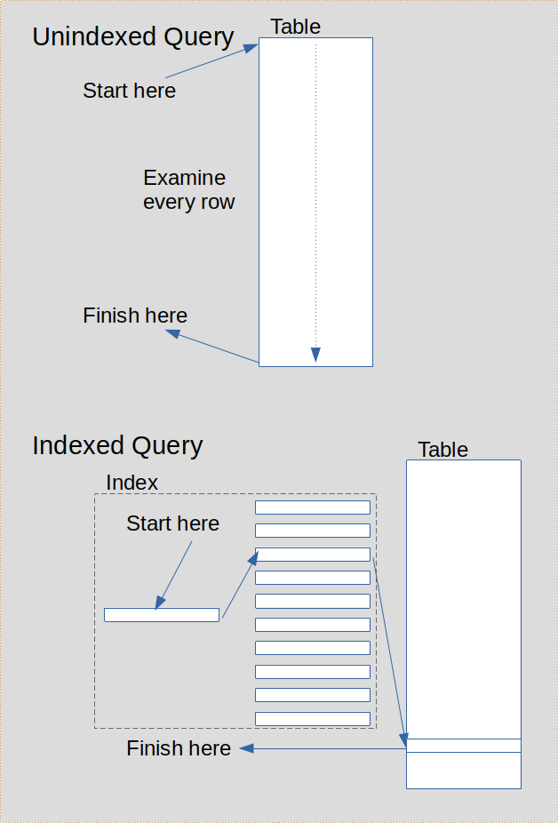

# More Queries
## Objectives
*   Use sub-queries to access multiple tables in a query
---
## Subqueries
It is sometimes necessary to base the results of one query on what you get from another, for example, to find all customers from the same country as Mary Saveley:
```sql
    SELECT country FROM customers
      WHERE name = 'Mary Saveley';
    ...
    SELECT * FROM customers
      WHERE country = <result from 1st query>;
```
This is very clumsy, you have to retype the result of the first query in the second. It would be much better to have just one query that works for whatever name we provide!

We can rewrite that as:
```sql
    SELECT * FROM customers
      WHERE country = (
            SELECT country FROM customers
              WHERE name = 'Mary Saveley');
```
* Subqueries are always enclosed in parentheses (...).
* The subquery provides the value for country required by the WHERE condition.
* Notice that the subquery is written last but is executed first, as in the original two query solution.

You can use a subquery on the right hand side (RHS) of a predicate, of the form:
```sql
    ... WHERE expr <op> (SELECT ...) ...
```
`<op>` is a comparison operator such as `=`, `>`, `<=`, etc.

For example:
```sql
    SELECT * FROM reservations
      WHERE (checkout_date - checkin_date) > (
          SELECT avg(checkout_date - checkin_date)
            FROM reservations);
```
What question does this query answer - remember that the inner query is executed first to provide a result to feed into the outer query.

Subqueries can also be used to check for the existence (or non-existence) of rows in other tables by using the EXISTS or NOT EXISTS keywords, for example:
```sql
    SELECT * FROM customers c
      WHERE EXISTS (SELECT 1 FROM reservations r
                          WHERE r.cust_id = c.id);
```
This example lists all customers who have at least one reservation.

It is also an example of a correlated subquery.

Correlated subqueries use values from the outer query - in this case the subquery can't execute first, they must both execute together. Note the use of `r.cust_id = c.id`; `r.cust_id` is from the subquery but `c.id` comes from the outer query.

For example:
```sql
    SELECT c.name, c.country,
           r.checkout_date - r.checkin_date as nights
      FROM customers c
      JOIN reservations r ON (r.cust_id = c.id)
      WHERE r.checkout_date - r.checkin_date =
            (SELECT max(y.checkout_date - y.checkin_date)
              FROM customers x
              JOIN reservations y ON (y.cust_id = x.id)
              WHERE x.country = c.country);
```
Notice that the inner query is using the value of `c.country` from the outer query. Can you work out what question this query answers?

You can use subqueries in many places where you would use a column name or a table name. For example:
```sql
    SELECT name, email,
           (SELECT count(*) FROM reservations r
             WHERE r.cust_id = c.id) bookings_made
      FROM customers c
      WHERE country = 'USA';
```
Returns name, email and the number of reservations for all USA customers.

This is another example of a "correlated subquery" when the subquery uses a value from the outer query (`c.id` in this case).

You can use a subquery in place of a table (in postgreSQL you must always use a subquery alias for these). For example:
```sql
    SELECT MAX(sumn) AS max_cust_nights
      FROM (SELECT SUM(checkout_date - checkin_date) AS sumn
              FROM reservations
              GROUP BY cust_id
           ) AS sub1;
```
You can use this construct in a wide variety of contexts. One classic use is in SQL dialects that don't support nested aggregate functions you can use a subquery to find things like `MAX(SUM(expr))`.

---

## Exercise
Use subqueries to resolve the following:
1.  List all rooms for which there are no reservations for the next month.
2.  How many customers have not made any reservations within the last 30 days?
3.  List all customers along with the total of all the invoices they have paid. Don't include unpaid invoices. Some customers have no invoices - leave the total blank.
4.  What is the maximum number of reservations in any month (based on checkin date)?
Hint - use the date_trunc function...
5.  Bonus Question : List all the reservations for the month which has the largest number of reservations. (hint: nesting)

---
## Transactions
By default, PostgreSQL runs each INSERT, UPDATE or DELETE in its own transaction - it either succeeds or fails. But the ACID rules require us to be able to make several changes that either all succeed or all fail. To do this we use a transaction.

For example, in banking, a money transfer between accounts must debit the ‘from’ account and credit the ‘to’ account as a single operation - but this needs two update commands. So...

Start a transaction using the command:

    BEGIN TRANSACTION;

… then issue INSERT, UPDATE and/or DELETE commands

End the transaction with either:

    COMMIT;        -- make changes permanent

or:

    ROLLBACK;    -- undo changes since last BEGIN

---
### Exercise - Using Transactions
1.  In the psql command line tool, issue the commands:
```sql
    BEGIN TRANSACTION;
    UPDATE reservations SET room_no = 310 WHERE id = 10;
```
Now open a new terminal session (leaving the first still open) and in psql do:
```sql
SELECT * FROM reservations WHERE id = 10;
```
What do you notice about room_no? Leave this session open as well.

2.  Go back to the first terminal session (which should still be open in psql). Issue the following command:
```sql
COMMIT;
```
then return to the second terminal session and requery reservation 10. What has changed?

3.  Repeat step 1 of this exercise (use the same two terminal sessions if you wish).

4.  In the second terminal session issue the command:
```sql
UPDATE reservations SET room_no = 304 WHERE id = 10;
```
What happens?

5.  Leaving the second terminal open, go back to the first session and issue the command:
```sql
ROLLBACK;
```
Now check what has happened in the second session. Why do you think that happened? Requery reservation id 10 and check the room number.

---
### ACID Rules
ACID is a mnemonic for:

* Atomic - all related changes succeed or all fail
* Consistent - committed changes leave the database
consistent (all rules obeyed)
* Isolation - users always see a consistent image, can’t see
incomplete changes
* Durable - committed changes are permanent (even after
power failure)

---
## Locking
Databases use locking mechanisms to control concurrent activity to ensure it remains consistent and safe.

Locking systems are beyond the scope of this course but for the moment you can imagine that when a computer process locks a resource that resource has limited accessibility for other processes.

Locking prevents another user from breaking the chnages you have made during a transaction. It is largely automatic, governed by the RDBMS.

For example:
Time | User A Activity | User B Activity | Comments
-----|-----------------|-----------------|---------
10:31 | Start a transaction | |
10:32 | Change record 31 | | User A gets a lock on record 31
10:33 | | Starts a transaction |
10:34 | | Tries to change record 31 | Is blocked by user A's lock
10:35 | Commit changes | | User A's lock is released
10:36 | | Re-read record 31 & check it's the same | 
  | | | If it's the same then re-try the change |

### When Does Locking Occur?
Whenever you issue an INSERT, UPDATE or DELETE command the RDBMS locks the record(s) you are processing, automatically.

You can also lock rows explicitly during a query by using the `FOR UPDATE` clause:
```sql
SELECT ... FROM customers
  WHERE id = 31
  FOR UPDATE;
```
The `FOR UPDATE` clause tells the RDBMS to lock the selected rows pending an UPDATE or DELETE operation on those rows.

You can lock rows and tables in various modes. In general you don't lock tables explicitly but the RDBMS may lock them for various operations (for example, ALTER TABLE, DROP TABLE, etc.). You can refer to the documentation to see how PostgreSQL manages locks on tables and rows: https://www.postgresql.org/docs/current/explicit-locking.html

It is important to ensure that locks are held for the shortest possible time to permit the maximum multi-user concurrency on your database. This requires that locks are NOT held on tables or rows while the user is entering data at the computer. Consider the following timeline:

The sequence of events in a transaction:
1.  Query the data to be changed (don't lock)
2.  Display the data to the user (so the user can change the data as required)
3.  User makes changes on the screen here - time passes...
4.  User eventually clicks Submit (or some similar button)
5.  Query the data again - this time locking the rows (`SELECT ... FOR UPDATE`)
6.  Compare the new query results with the original query results from 1. (unchanged)
7.  If they are the same then make changes on the DB then `COMMIT`
8.  If they are different then warn the user to restart the process

Note that step 3. is, in computer terms, a VERY slow process. It's important the locks are not held while the user is thinking and entering data.

### Exercise: Commit and Rollback
1.  Using psql, start a transaction in your hotels database
2.  Query the customers table (all rows)
3.  Change a row in the customers table then commit
4.  Start a new transaction...
5.  Make another change to a different row in the customers table then rollback
6.  Query the customers table again - which rows have been changed?

### Exercise: Read Consistency
1.  In a terminal, query the customers table (all rows)
2.  Start a transaction
3.  Make a change to the customers table - DON’T commit
4.  Open a second terminal and connect to your hotels DB
5.  Query the customers table - can you see the change?
6.  Go back to first terminal session and commit
7.  Go back to second session and requery - can you see the change?

### Exercise: Locking
1.  Start a transaction in your hotels database and make a change to a row (don't commit or rollback)
2.  Open a new terminal and connect to the hotels database
3.  Start a new transaction in the new session
4.  Make a change to the same row in your database.  What happens?
5.  Go back to the first session and rollback
6.  What happens in second session

---
### Locking in Other Databases
In most DBs a lock conflict causes the second (and any subsequent) lock request to suspend until the resource (e.g. a row) is no longer locked. 

Some DBs provide a NOWAIT option on commands that take out locks such that the command ends immediately with an error if a conflict occurs. (mySQL, Oracle, PostgreSQL,...). For example:
```sql
SELECT * FROM customers
  WHERE id = 31
  FOR UPDATE NOWAIT;
```
If the above query finds it cannot lock the relevant row because it's already locked by another user then it will return an error rather than wait for the row to become available.

---

## More on CREATE TABLE, etc.

### Defining Constraints
You can define different kinds of constraints on a table. We have already seen primary keys and foreign keys, but just to recap:

Define a single column primary key:
```sql
CREATE TABLE rooms
  room_no     INTEGER PRIMARY KEY,
  ...
  );
```
You can also define an autoincementing primary key (that has its value incremented each time a new row is inserted):
```sql
CREATE TABLE reservations (
  id          SERIAL PRIMARY KEY,
  ...
  );
```
Note that the SERIAL keyword is a pseudo-type and implies INTEGER. Use the `\d <table_name>` command to see the full implementation of SERIAL.

Note aslo that `PRIMARY KEY` implies `NOT NULL`.

If the primary key comprises multiple columns then the above method won't work. Instead we use a separate constraint definition, usually placed after all the column definitions, as follows:
```sql
CREATE TABLE invoice_items (
  invoice_no      INTEGER NOT NULL,
  item_no         INTEGER NOT NULL,
  charge_type     VARCHAR(30) NOT NULL,
  amount          NUMERIC(6,2) NOT NULL,
  ...
  comment         VARCHAR(240),
  PRIMARY KEY (invoice_no, item_no),
  FOREIGN KEY (invoice_no) REFERENCES invoices(id)
);
```
Here the `PRIMARY KEY` keywords appear at the beginning of the constraint definition followed by the primary key columns in parentheses (). The primary key still implies `NOT NULL` so the columns don't need to be declared as such, but some developers prefer to make it explicit when the constraint is defined separately.

Note also that a part of a primary key can be a foreign key to another table (e.g. invoice_no). That constraint has also been defined separately, a convention that some people prefer. A separate constraint is, of course, required when the foreign key comprises multiple columns, as below:
```sql
CREATE TABLE item_breakdown (
  ...
  FOREIGN KEY (invoice_no, item_no) REFERENCES invoice_items (invoice_no, item_no),
  ...
);
```
### Check Constraints
The `NOT NULL` part of a column definition is also a constraint, ensuring that each row contains a value in that column.

You can also provide custom checks on column values to ensure further compliance with business requirements. For example, it could be beneficial to ensure that data entered for checkin date and checkout date in a reservation are chronologically sensible.
```sql
CREATE TABLE reservations (
  ...
  CHECK (checkin_date <= checkout_date),
  ...
);
```
Check constraints can only refer to columns in the row being inserted/updated and literal values. You cannot use subquries nor function values that could return different data on different occasions (e.g. current_date). Check constraints must always give a TRUE answer for the lifetime of the row.

You can use any of the SQL conditional operators `=`, `<`, `>`, `<=`, `>=`, `!=`, `IN (...)`, `BETWEEN x AND y` or `LIKE...`

### Exercise:
1.  Define a check constraint on the rooms table to ensure that rate must be greater than zero.
2.  Ensure that the reservation checkin date must be the same as or later than the booking date
3.  Ensure that rooms can only take between 1 and 4 guests
4.  Use your SQL skills to test these constraints by attempting to insert rows that violate the constraints

---

## Designing for Performance
Databases must handle a large number of actions every second, often accessing tables containing millions of rows, so it's important to ensure good performance. 

You can define indexes to improve access to particular column values. Such indexes are used when you specify the column value in WHERE clauses, etc.



In the unindexed query case the RDBMS scans the entire table, examining each row in turn. To do this it must read each physical database block containing rows, a relatively expensive action involving potentially hundreds or thousands of I/O operations. These 'full table scans' are generally undesirable on large sets of data but for small tables they provide the fastest access route.

Using an index can often find the required data much faster in large tables. An index is a hierarchical structure rather like an inverted tree. The trunk is the starting point for searching and the leaves are the end points. To find the leaf (or leaves) we want we just have to move along the relevant branches, ignoring leaves on other branches. This can significantly reduce the amount of I/O activity and make the search much faster. Most indexes use a technology called 'B-Tree' to structure the index.

An index is defined by specifying the columns of the table that are to be indexed. An index can be defined for one or more columns. When an SQL statement refers to an indexed column in its `WHERE` conditions it's possible that the optimiser may use the index to speed the search. The optimiser is a set of rules and algorithms defined in the RDBMS that tries to find the best pathway to get the required data.

Some indexes are created automatically as part of other features of the database. For example, in PostgreSQL, an index is created for the primary key of the table - this is the simplest way to ensure that primary key values are unique across the table.

Do be aware, however, that there are also costs in providing indexes. Each index must be adjusted for every new row added to and every row deleted from the table. It must also be updated each time the indexed columns are updated. The database designer must take this into account when defining indexes to speed queries.

To create an index on a table we use the `CREATE INDEX` command:
```sql
CREATE INDEX res_cust_id ON reservations(cust_id);
```
This index could be used to resolve queries that include:
```sql
  SELECT ... FROM reservations ... WHERE cust_id = 1234 ...
```
or
```sql
  SELECT ... FROM reservations ... WHERE cust_id BETWEEN 1234 AND 1245 ...
```
It's less likely to be used for a query that has:
```sql
  SELECT ... FROM reservations ... WHERE cust_id < 1234 ...
```
because the less than operator could generally refer to a large number of rows and lead the optimiser to prefer a full table scan.

Notice that you cannot and should not normally specify whether an index is to be used or not.

You can define an index on multiple columns and this could be used when any leading part of the index is specified in the `WHERE` conditions. For example:
```sql
CREATE INDEX res_cust_checkin ON reservations (cust_id, checkin_date);
```
This index could be used when a query specifies `WHERE cust_id = 1234 AND checkin_date = '2020-06-12'` or when the query specifies only `WHERE cust_id = 1234`. It is not likely to be used if the where condition only specifies `WHERE checkin_date = '2020-06-12'`. Note also that this new index makes the previous one on `cust_id` alone fairly redundant.

You can define a unique index that enforces uniqueness in the indexed coumn(s). For example:
```sql
CREATE UNIQUE INDEX cust_email ON customers(email);
```
This is equivalent to defining a UNIQUE constraint in the table definition:
```sql
  ...
  email         VARCHAR(120) NOT NULL UNIQUE,
  ...
```
or, like this at the end of the table definition:
```sql
CREATE TABLE customers (
  id            SERIAL,
  name ...
  ...
  email         VARCHAR(120) NOT NULL,
  ...
  PRIMARY KEY (id),
  UNIQUE (email),
  ...
);
```

### Exercise:
1.  Create an index on the checkin date in the reservations table.
2.  Create a unique index on the combined room_no and checkin_date columns in the reservations table. You can use any valid method to do this.

Interesting Question:

What is the guaranteed performance effect of adding an index to a table?

Discuss...

## Lesson Summary
In this lesson you have learned how to:

* Use sub-queries to access multiple tables in a query
* Start and complete transaction in PostgreSQL using COMMIT and ROLLBACK
* Use locking to ensure consistent data
* Define indexes to improve query performance

---
## Homework
1.  Complete any exercises you have not yet finished from this lesson.
2.  Oh - I just can't think of anything...
---
